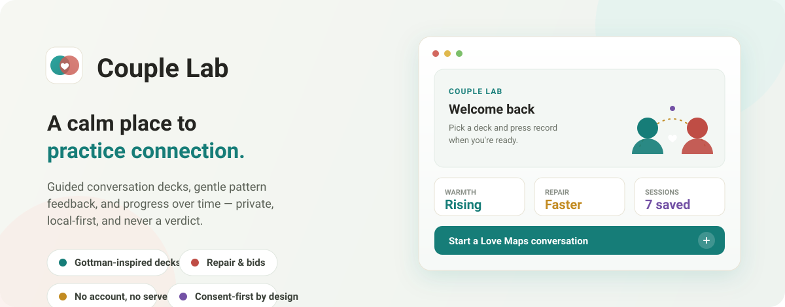

<p align="center">
  
</p>

<h1 align="center">Couple Lab</h1>
<p align="center"><strong>A calm, private place for couples to practice connection.</strong></p>

Couple Lab is a local-first, desktop-ready practice app that helps partners build respect,
affection, calm conflict, intimacy, and shared meaning. It pairs guided conversation prompts with
optional recording, transcript reflection, and gentle pattern feedback — inspired by Gottman-style
friendship/conflict research and Esther Perel-style attention to desire, play, and aliveness.

> **What it is — and isn't.** Couple Lab makes better conversations *more likely and easier to
> repeat*. It is **not** a therapist, a diagnostic system, an official Gottman product, or a
> divorce predictor. Every flagged pattern is a prompt for reflection you can relabel or reject —
> never a verdict. If there is fear, coercion, or abuse, the app steps out of practice mode and
> points toward professional support.

<p align="center">
  
</p>

## Features

- **Assessment** across ten domains — friendship, fondness, turning toward, emotional safety, calm
  conflict, repair, intimacy & desire, shared meaning, flooding recovery, and life teamwork.
- **Conversation decks** — Love Maps, Fondness & Admiration, Repair, Gridlock→Dreams, Desire &
  Aliveness, Shared Meaning (Gottman/Perel-inspired prompts).
- **Practice Studio** — one workspace with prompts, optional camera + recording, live transcript,
  manual notes, and nonverbal cues.
- **Relationship analysis** — tags validation, fondness, soft startup, repair attempts, bids/turning
  toward, and risk patterns (Four Horsemen-style), each linked to evidence in the transcript.
- **Coaching report** — strengths, risks, next steps, and scripts; print / save as PDF; optional
  local Ollama coaching note.
- **Insights over time** — track quicker repair, more warmth, and better recovery across sessions.

## Privacy first

Everything — profiles, scores, transcripts, exports — stays in your own browser/device storage.
There is no account and no server. Camera/microphone use is gated by the browser permission prompt;
MediaPipe vision models load from Google's CDN on first use only.

## Run

```bash
npm install
npm run dev      # then open http://127.0.0.1:5173
```

On Windows you can also double-click **`Open Couple Lab.cmd`**.

**Desktop app** (Electron wrapper): `npm run desktop`
**Build / verify**: `npm run build`

## Tech

React 18 + TypeScript + Vite, an Electron entry point, `@mediapipe/tasks-vision` for face/body
cues, `lucide-react` icons, and the browser SpeechRecognition + MediaRecorder APIs. No backend.

## Ethics & accuracy

- Says "possible pattern," never "you are."
- Every flagged moment links to transcript/cue evidence, and you can reject it.
- Facial/posture inference is treated as a *weak* signal unless confirmed by transcript + partner.
- Risk is a trend over time, not a single-session judgement.
- See `docs/PRODUCT_PLAN.md` for the full roadmap and measurement model.

## Contributing

Issues and PRs welcome — more decks, better pattern detection, offline Whisper transcription,
accessibility, translations, or design. Please keep the non-clinical, consent-first, privacy-first
stance intact.

## License

[MIT](LICENSE). Couple Lab is an educational practice tool, not medical or psychological advice.
