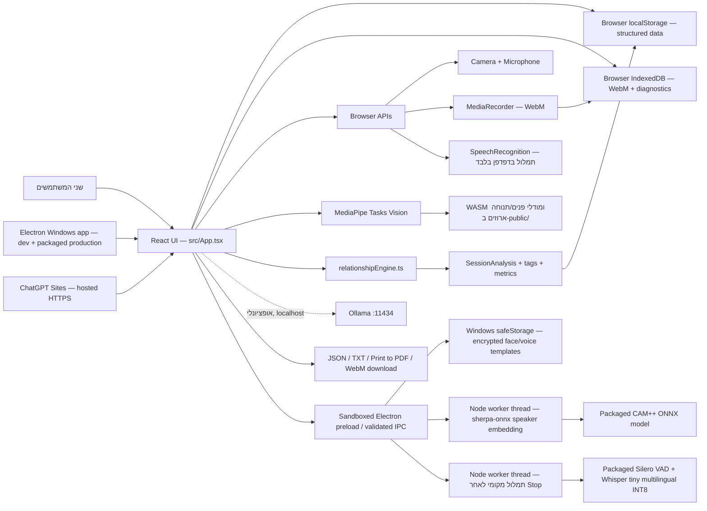

# ארכיטקטורת Couple Lab

**סטטוס:** תיאור המימוש הנוכחי (as-built)  
**עודכן לאחרונה:** 2026-08-14 (Golden moments, cross-session transcript search, drop-in ASR upgrade)
**מיועד ל:** מפתח/ת אנושי/ת או סוכן AI שממשיך לפתח את המוצר

מסמך זה הוא מקור האמת למבנה התוכנה. הוא מתאר את מה שקיים בקוד עכשיו, לא רק את חזון המוצר. לפני שינוי יש לקרוא אותו, ואחרי שינוי ארכיטקטוני יש לעדכן אותו לפי נוהל התחזוקה בסוף המסמך.

## 1. מטרת המוצר והגבולות שלו

Couple Lab היא אפליקציית React מקומית לתרגול תקשורת זוגית. היא כוללת הערכה עצמית, מאגר שאלות, הקלטת שיחה, תמלול, סימון ידני, ניתוח כללים, רמזים חזותיים, תובנות, דוח וייצוא.

עקרונות שאסור לשבור:

- המערכת היא כלי תרגול ורפלקציה, לא מטפל, אבחון קליני, חיזוי פרידה או קביעת אשמה.
- כל מסקנה צריכה להיות מנוסחת כרמז אפשרי ולהישען ככל האפשר על ראיה מתויגת.
- רמזי מצלמה וקול חלשים יותר מאישור בני הזוג ומהתמלול.
- כאשר מסומן חשש לבטיחות, מצב ההקלטה נחסם והמערכת מפנה לבחינה של תמיכה אישית/מקצועית.
- נתונים מובנים נשמרים ב־`localStorage`; הקלטות ולוג אבחון מסונן נשמרים ב־IndexedDB באותו מכשיר ו־origin. אין כרגע משתמשים, שרת אפליקציה, מסד נתונים מרוחק או סנכרון ענן.

## 2. תמונת מערכת



האפליקציה היא Single Page Application ללא router חיצוני. המסך הפעיל נשמר בפרמטר `?view=` ומנוהל ב־state של `App`. מעבר מסך מוסיף רשומת browser history, ו־`popstate` מאפשר לכפתור Back של Android לחזור למסך הקודם.

## 3. טכנולוגיות והרצה

| שכבה | טכנולוגיה | תפקיד בפועל |
|---|---|---|
| UI | React 18 + TypeScript | כל המסכים והלוגיקה האינטראקטיבית |
| Build/dev | Vite 8 | שרת פיתוח ובניית bundle סטטי מקומי |
| עיצוב | CSS משותף ב־`src/styles.css` וב־`src/design-overrides.css` | בסיס רכיבים/print ושכבת העולם החזותי, layout ו־responsive |
| אייקונים | `lucide-react` | אייקוני ממשק |
| ראייה ממוחשבת | `@mediapipe/tasks-vision` | זיהוי פנים, blendshapes ותנוחות בדפדפן |
| embedding קולי | `sherpa-onnx-node` + 3D-Speaker CAM++ | וקטור קול מקומי של 192 ממדים בתהליך Worker של Electron |
| מעטפת desktop | Electron + electron-builder | אפליקציית Windows שטוענת `dist` מ־origin מקומי מאובטח וניתנת לאריזה כ־portable exe |
| מעטפת mobile | PWA | manifest, service worker, install prompt ו־standalone display ב־Android/Chromium |
| Hosting | ChatGPT Sites + vinext/Cloudflare Worker | כתובת HTTPS פרטית/משותפת; משתמש באותו `src/App.tsx` דרך `sites-app/` |
| אחסון | Web Storage + IndexedDB | נתונים מובנים ב־localStorage; הקלטות ולוג אבחון מסונן ב־IndexedDB |
| הקלטה/תמלול | Browser Media APIs | וידאו WebM ותמלול SpeechRecognition כאשר נתמך |
| בדיקות | Vitest | בדיקות מנוע ניתוח, שערי ראיות/מצבי סשן ומדדי WER/CER לתמלול |

פקודות מרכזיות:

```bash
npm run dev       # Vite על 127.0.0.1:5173
npm run build     # TypeScript typecheck ואז Vite build
npm run preview   # תצוגת dist מקומית
npm run desktop   # Vite + Electron במקביל
npm run desktop:run    # build והרצת Electron מקומית ללא שרת
npm run desktop:smoke  # בדיקת טעינת production והפעלת preload/IPC
npm run desktop:shortcut # יצירת קיצור דרך מקומי בשולחן העבודה
npm run desktop:dist   # יצירת portable exe בתוך release-desktop/
npm --prefix sites-app run dev    # תצוגת Sites מקומית
npm --prefix sites-app run build  # build תואם Sites/Cloudflare Worker
```

`Open Couple Lab.cmd` מתקין dependencies אם חסרים, מריץ build ומפעיל ישירות את `node_modules/electron/dist/electron.exe` מול תיקיית הפרויקט; הוא אינו עובר דרך wrapper מסוג `electron.cmd`, אינו פותח URL ואינו זקוק לשרת Vite או לדפדפן. `scripts/install-desktop-shortcut.ps1`, דרך `npm run desktop:shortcut`, יוצר בשולחן העבודה קיצור בשם Couple Lab שמפנה ישירות ל־`electron.exe` עם תיקיית הפרויקט כיישום ומשתמש באייקון היישום. כך לחיצה רגילה אינה פותחת דפדפן, שרת או חלון CMD; בנייה מחדש נעשית דרך המשגר או פקודת build. Electron אוכף מופע יחיד: פתיחה נוספת ממקדת את החלון הקיים. `npm run desktop` נשאר מסלול hot-reload לפיתוח. Vite מוגדר עם `strictPort` על 5173 כדי להיכשל באופן גלוי אם שרת ישן מחזיק את הפורט, במקום לפתוח בשקט פורט אחר ולהשאיר למשתמש refresh של גרסה ישנה. בייצור Electron מגיש את הנכסים מתוך `dist` ב־origin הקבוע `couple-lab://app`, וה־renderer נשאר sandboxed עם `contextIsolation: true` ו־`nodeIntegration: false`.

`sites-app/` היא מעטפת הפרסום של אותו UI ל־ChatGPT Sites. `app/page.tsx` מייבא את `src/App.tsx`, ו־`app/layout.tsx` טוען במפורש את `src/styles.css` ואת `src/design-overrides.css`; היא מגישה את `public/` ומייצרת Worker תואם לפרסום. `sites-app/.openai/hosting.json` מקשר את הקוד לפרויקט Sites; אין בו D1/R2 ולכן Sites אינו שומר כרגע פרופילים, סשנים, וידאו או דוחות בשרת.

## 4. מבנה הקוד ואחריות

| נתיב | אחריות | כללי שינוי |
|---|---|---|
| `src/main.tsx` | נקודת הכניסה של React וטעינת CSS | להשאיר קטן; לא להכניס לוגיקה עסקית |
| `src/App.tsx` | shell, ניווט, state, כל המסכים, Media APIs, MediaPipe, export ו־Ollama | זהו כרגע קובץ מונוליתי; בפיצול עתידי יש לשמור על חוזי הנתונים והזרימות |
| `src/types.ts` | חוזי TypeScript לכל הישויות המרכזיות | שינוי shape מחייב אסטרטגיית תאימות/מיגרציה לנתונים ישנים |
| `src/data.ts` | ברירות מחדל, תחומי הערכה, חפיסות שאלות והערות אמינות | תוכן סטטי בלבד; לא לשים כאן state של משתמש |
| `src/relationshipEngine.ts` | מנוע דטרמיניסטי: זיהוי תבניות, tags/hits, מדדים, סיכום והמלצות | חייב להישאר לא־אבחוני, מבוסס ראיות וניתן לבדיקה ללא UI |
| `src/adviserRecommendation.ts` | בחירת יעד המדריך וחפיסת התרגול לפי safety, הסשן האחרון ומפת הקשר | יעד safety אינו רשאי לפתוח תרגול; כל deck id חייב להתאים לחפיסה קיימת |
| `src/sessionFlow.ts` | מכונת המצבים המותרת של סשן ושער מינימום הראיות | שינוי ספים או מעבר מצב מחייב בדיקות regression |
| `src/questionRotation.ts` | בחירת שאלות ללא חזרה עד מיצוי החפיסה ונרמול היסטוריית השאלות | שינוי אלגוריתם הסבב מחייב בדיקה שהשאלה האחרונה אינה חוזרת מיד ושכל החפיסה מוצגת לפני חזרה |
| `src/localStore.ts` | IndexedDB להקלטות וללוג אבחון מסונן | אין לשמור בלוג תוכן שיחה, תמלול, שמות או frames |
| `src/desktopFoundation.tsx` | פתיחת זרימת הזיהוי לזוג או לאדם יחיד, מצב מוכנות, פרטיות ומחיקה | המונחים הטכניים מוסתרים מהזרימה הרגילה; מחיקה עוברת דרך bridge מצומצם |
| `src/BiometricEnrollmentWizard.tsx` | פתיחת media ישירה לאחר פעולה יזומה, שתי הקלטות קול, ארבע דגימות פנים, תמונת פרופיל מקומית ושמירת enrollment | אין לשמור audio או frames גולמיים פרט לתמונת הפרופיל המוקטנת; כשל הרשאה/מודל מציג retry ודילוג, וכשל איכות מחייב ניסיון חוזר |
| `src/faceDescriptor.ts` | הפקת descriptor גאומטרי מנורמל מנקודות MediaPipe ובדיקת איכות frame | זהו רמז זהות קל משקל, לא face-recognition כללי ולא ראיה לרגש |
| `src/biometricQuality.ts` | resampling/איכות אודיו, cosine similarity ובדיקת הפרדה בין בני הזוג | בדיקת הכיול אינה מוצגת כאחוז דיוק אמיתי |
| `src/biometricReadiness.ts` | אמת אחת למוכנות זיהוי: לפחות תבנית פנים ותבנית קול לכל אדם | רשומת enrollment חלקית אינה נחשבת לזיהוי מוכן |
| `src/visionAssets.ts` | פתרון כתובות same-origin ל־WASM ולמודלי MediaPipe ב־Vite וב־Electron | אין להחזיר תלות CDN; יש לבדוק גם `couple-lab://app` וגם localhost |
| `src/transcriptionEval.ts` | נרמול והשוואת תמלול ל־reference באמצעות WER/CER | מיועד ל־QA; אינו מוכיח איכות ללא קובץ בדיקה מייצג |
| `electron/transcription-pipeline.cjs` | פונקציות טהורות לטווחי VAD, כיסוי דיבור, מניעת כפילות גבול ו־confidence proxy | איכות הסתברותית אינה דיוק מכויל; fallback אינו רשאי להמציא זמני דיבור |
| `src/transcriptCorrection.ts` | prompt ו־validation לתיקוני תמלול מוצעים ממודל Ollama מקומי | ההצעה חייבת לשמר id/order, מספרים ושלילות; אין לשנות טקסט או ניתוח לפני אישור בני הזוג |
| `src/acousticFeatures.ts` | הפקת מדדי דיבור/שקט, הפסקות ושינויי עוצמה יחסיים מ־PCM מקומי | מאפיינים תיאוריים בלבד; אין להסיק מהם כעס, מתח או רגש |
| `src/visualObservation.ts` | כיסוי מצלמה, תנועת גוף ושינויי כיוון ראש מנורמלים | איכות צילום אינה ראיה התנהגותית; אין לשמור landmarks גולמיים |
| `src/*.test.ts`, `vitest.config.ts` | בדיקות אוטומטיות ממוקדות | להריץ `npm run test` לפני build/פרסום |
| `src/styles.css` | שכבת העיצוב הבסיסית: רכיבים, מצבים, responsive ו־print | שינוי מבני ב־DOM עשוי לדרוש עדכון selectors והדפסה |
| `src/design-overrides.css` | שכבת העולם החזותי המשותפת לשתי המעטפות: palette, typography, shell, בית ו־Practice responsive | נטען אחרי `styles.css`; החלטות מערכת יציבות מתועדות גם ב־`DESIGN.md` וב־`.impeccable/design.json` |
| `DESIGN.md`, `.impeccable/design.json` | חוזה מערכת העיצוב וה־sidecar המכני שלה | לעדכן אחרי שינוי עיצוב מערכתי; אין להפוך חריג חד־פעמי לטוקן |
| `electron/main.cjs` | custom protocol, חלון production/dev, הרשאות, IPC ואחסון מוצפן | לא לחשוף filesystem/IPC כללי; לאמת sender ו־payload לכל פעולה |
| `electron/preload.cjs` | API מצומצם ל־runtime ולאחסון תבניות זיהוי | לחשוף פעולות שמיות בלבד דרך `contextBridge`; אין להעביר `ipcRenderer` גולמי |
| `electron/biometric-validation.cjs` | validation ונרמול של vectors וסיכומי enrollment | מגביל dimensions וכמות דוגמאות; שינוי schema מחייב בדיקות ומיגרציה |
| `electron/voice-embedding-worker.cjs` | טעינת CAM++ וחישוב speaker embedding מחוץ ל־main/renderer | מקבל PCM mono 16k בלבד; אינו שומר אודיו |
| `models/` | מודל CAM++ ONNX, מקור ורישיון | נארז כ־extraResource; שינוי מודל מחייב model id חדש ובדיקת תאימות |
| `public/` | favicon, מדיה סטטית, MediaPipe WASM ומודלי face/pose | נכסי הראייה נארזים לתוך `dist`; אינם נשמרים כחלק מסשן |
| `scripts/install-desktop-shortcut.ps1` | יצירת קיצור דרך מקומי עם אייקון Couple Lab | הקיצור מפנה ישירות ל־Electron עם תיקיית הפרויקט כיישום; אין להפנות אותו ל־URL, לשרת Vite או למשגר Web |
| `public/manifest.webmanifest` | metadata להתקנת PWA | שינוי scope/start URL/icons מחייב בדיקת התקנה מחדש |
| `public/sw.js` | cache של app shell ונכסי same-origin לאחר בקשה | מודלי MediaPipe הם same-origin ונשמרים ב־cache לאחר טעינה מוצלחת; אינם ברשימת pre-cache |
| `sites-app/` | מעטפת vinext ו־Cloudflare Worker לפרסום ב־ChatGPT Sites | חייב להמשיך לייבא את מקור האמת מ־`src/`; אין לשכפל לוגיקת מוצר או להוסיף אחסון שרת ללא תכנון פרטיות |
| `docs/PRODUCT_PLAN.md` | מפת דרכים ועקרונות מוצר | עתיד/כוונה; אינו מחליף את המסמך הנוכחי |
| `docs/UX_FLOW_REVIEW.md` | ביקורת UX ורעיונות לשיפור | המלצות, לא תיאור מחייב של המימוש |
| `tools/` | סקריפטים חד־פעמיים ליצירת מדיה/דמו | אינם חלק מ־runtime או מ־build של האפליקציה |
| `adam-porat-graduation-animation/` | פרויקט HyperFrames עצמאי שמייצר נכס אנימציה | כפוף גם ל־`AGENTS.md` הפנימי; אינו dependency של React |

## 5. ניווט ומסכים

הטיפוס `View` מגדיר אחד־עשר מצבים, כולל `setup` שאינו יעד ניווט קבוע ו־`settings` שנפתח מתוך More. `App` מחזיק את ה־state המשותף ומעביר props למסכים. ב־desktop סרגל הצד מציג, לפי הסדר, Home, Practice, Insights, Adviser, Report ו־More. ברוחבי ביניים עד 1120px הוא הופך לכותרת ניווט אופקית, ובטלפון עד 760px נשארים ארבעה יעדים במסילה התחתונה — Home, Practice, Insights ו־More. Adviser, Report, Assess, Settings, Export/Safety ו־Diagnostics נגישים מתוך More, כך שהסתרת שני היעדים המשניים מהמסילה אינה מנתקת אותם:

| View | רכיב | קלט עיקרי | פלט/שינוי state |
|---|---|---|---|
| `dashboard` | `FirstRunDashboard` או `Dashboard` | מצב השלמת ההגדרה, פרופיל, assessment, סשן אחרון ומצב enrollment | לפני השלמה: הסבר קצר ופעולה אחת להתחלת ההגדרה, ללא שאלות או מדדים. אחרי השלמה: סיכום, התקדמות, התחלת תרגול, בחירת תחום והגדרות |
| `setup` | `Dashboard` במצב setup | פרופיל, assessment ו־enrollment | רישום סדרתי לכל אדם: שם אישי בשדה → שאלון אישי → פעולה יזומה אחת שמפעילה ישירות זיהוי קולי → זיהוי פנים ותמונת פרופיל; לאחר שמירת השאלון הוא מוסר מה־DOM; אפשר לדלג על הזיהוי, וסיומו מעביר ישירות לאדם הבא; מסך handoff מסתיר תשובות לפני המעבר |
| `assess` | `AssessView` | פרופיל והערכות A/B | תשובות נפרדות, אישור השלמה לכל בן/בת זוג והמשך רק לאחר ששניהם השלימו |
| `practice` | `PracticeStudio` | פרופיל, signals, safety, deck stats ו־practice launch אופציונלי | חפיסה/שאלה שמגיעות מהמדריך או ברירת מחדל, מצלמה אוטומטית, כניסה ישירה ללימוד זהות חסרה, consent גורף מקומי בפעם הראשונה, הקלטה, תמלול, שיוך זהות/דובר הסתברותי, שמירה מקומית, הצגת התמלול השמור וניתוח לאחר שמירה |
| `insights` | `InsightsView` | רשימת סשנים | בחירת סשן, קריאת התמלול שנשמר ולאחריו הניתוח, צפייה בהקלטה ומחיקת קובץ ההקלטה |
| `adviser` | `AdviserView` | פרופיל, הערכה, סשנים, safety | המלצה שממופה לחפיסה מסוימת, בחירה בין כל חפיסות התרגול ופתיחת Practice עם הבחירה; safety מפנה למסך הבטיחות |
| `report` | `ReportView` | פרופיל, הערכה, סשנים, safety | feedback מקומי, פנייה אופציונלית ל־Ollama, TXT/print |
| `settings` | `Dashboard` במצב settings | פרופיל, שפות ו־enrollment | עריכת שמות, יעד, שפה וזיהוי בלי לפתוח מחדש את שאלון הרישום |
| `export` | `ExportSafetyView` | כל המידע המרכזי | עדכון safety, JSON/TXT, מחיקת localStorage |
| `diagnostics` | `DiagnosticsView` | אירועים טכניים מסוננים מ־IndexedDB | רענון, ייצוא ומחיקת לוג ללא תוכן שיחה |
| `more` | `MoreView` | safety flag ורשימת סשנים | מדריך, דוח זוגי, מפת קשר, הגדרות, בטיחות וסודיות, בדיקות ותמיכה וסיכום מספר השיחות שנשארות במחשב |

אין router או deep routing מלא. רענון שומר רק את `?view=` ואת הנתונים שב־localStorage; state זמני של Practice Studio ו־practice launch אובד. כל מעבר גולל לראש ומעביר focus לכותרת הראשית. רישום ראשון נפתח מהבית אל `setup` ומתבצע אדם־אחר־אדם: כל אדם מזין שם, משלים את עשר תשובות ההערכה שלו, ואז השאלון נסגר והמסך מתמקד בזיהוי אופציונלי. סולם ההערכה נשאר נראה לפני הזנת השם אך נעול לוגית; לחיצה עליו אינה שומרת תשובה אלא מציגה הסבר בעברית, מעבירה focus לשדה השם וגוללת אליו. הסולם משתמש ב־radio semantics, ב־roving tab stop ובמקשי חצים לאחר פתיחתו. לחיצה על “כן, נתחיל” היא הפעולה היזומה שמפעילה media ומדלגת על מסך checkbox נוסף; הודעת השמירה המקומית מוצגת מתחת למצלמה. הזרימה מקליטה שני משפטים, מצלמת ארבע תמונות, שומרת תמונת פרופיל מוקטנת ומעבירה ישירות לאדם הבא. מסך handoff מסתיר את השם/התשובות של האדם הקודם, מעביר focus לכותרת ודורש אישור “אני X”; אותו כיסוי מופעל גם במעבר בין בני הזוג במסך ההערכה. זו מחיצת פרטיות משותפת ולא authentication. תשובות ו־enrollment נשמרים בכל שלב, ולכן אפשר לסגור אחרי אדם אחד ולחזור בלי להתחיל אותו מחדש. כל עוד שני השמות והשאלונים לא הושלמו האפליקציה כופה `dashboard`, משביתה יעדי ניווט אחרים ואינה מציגה readiness, שאלות או השוואות. בדפדפן/טלפון שלב הזיהוי מסביר בקצרה שיש לפתוח את אפליקציית המחשב. שפת הממשק הפעילה היא עברית אחידה; אפשרות אנגלית מוצגת כמושבתת עד להשלמת תרגום מלא, בעוד שפת התמלול ניתנת לבחירה בהגדרות.

## 6. מודל נתונים

החוזים המלאים נמצאים ב־`src/types.ts`. הישויות המרכזיות:

- `CoupleProfile`: שמות, יעד הקשר, תאריך יצירה, תמונות פרופיל מוקטנות אופציונליות כ־data URL לכל אדם, כיול מיקום פנים אופציונלי כולל snapshot ישן, והסכמה גורפת אופציונלית לשמירת הקלטות מקומיות (`recordingConsent`, גרסה 1, זמן והיקף).
- `BiometricEnrollmentState`: חוזה Desktop נפרד בגרסה 1 עבור עד 20 וקטורי פנים ועד 20 וקטורי קול לכל בן/בת זוג, עם model id, זמן, quality אופציונלי ו־vector מספרי מוגבל ל־4096 ממדים. אשף הכיול מפיק בפועל ארבעה descriptors גאומטריים של פנים ושני speaker embeddings של 192 ממדים לכל אדם.
- `AssessmentState`: תשובות 1–10 לכל domain, בנפרד ל־A ול־B, `completedBy`, `updatedAt` ו־`schemaVersion: 2` אופציונלי לתאימות.
- `TranscriptSegment`: דובר, יעד, טקסט, טווח זמן, מקור, שפה ומספר מילים; בתמלול Windows אפשר לשמור גם model/VAD id, סוג segmentation ו־confidence proxy שאינו ציון דיוק מכויל. אם בני הזוג מאשרים הצעת תיקון מקומית נשמרים גם `originalText` ופרטי model/time של התיקון, בעוד `text` הופך לגרסה שאושרה.
- `StoredTranscriptionMetadata`: מטא־דאטה של תמלול Windows לאחר Stop — משך אודיו, טווחי דיבור שזוהו, כיסוי דיבור/שקט, מספר מקטעים, fallback ואיכות זמינה מהמודל.
- `AcousticMetrics`: מדדים מקומיים ותיאוריים בלבד של דיבור/שקט, הפסקות ארוכות, שינויי עוצמה יחסיים והערכת קצב מילים. הם אינם קובעים רגש, כוונה או איכות הקשר.
- `LiveCue`: סימון ידני בזמן אמת כמו warmth, repair, overwhelm או pause.
- `VisualObservation`: רמז חזותי מתוזמן, נבדק, confidence, evidence, provider ו־metadata.
- `InteractionTag`: תג עשיר לציר הזמן, עם family, source, משתתפים, evidence והצעה.
- `PatternHit`: אירוע strength/risk/repair/body לצורכי דוח ותובנות.
- `SessionMetrics`: מדדי מילים, איזון, חיובי/סיכון/תיקון, self-reported flooding indicator, שדות emotional state תאומי־עבר לצורך תאימות וציון תרגול. שדות ה־emotional state אינם מוצגים למשתמש כקביעת רגש.
- `SessionAnalysis`: summary, metrics, strengths, risks, next steps, script, hits, tags ו־`dataQuality` שמונע ציונים כאשר אין מספיק ראיות.
- `SessionRecord`: מעטפת הסשן השמור וכל חומר הגלם והניתוח שלו, `processingStatus`, `schemaVersion: 2` ו־reference אופציונלי לקובץ מדיה ב־IndexedDB.
- `SessionMediaRef`: מפתח IndexedDB, MIME, גודל וזמן שמירה; ה־Blob עצמו אינו נכנס ל־localStorage או לייצוא JSON.
- `SafetyState`: ארבעת דגלי הבטיחות וזמן הבדיקה.

### תאימות נתונים

הנתונים החדשים נכתבים עם `schemaVersion: 2`, אך אין עדיין runner מלא למיגרציה. לכן:

- שדה חדש צריך להיות אופציונלי או לקבל fallback בכל מקום שקורא סשנים קיימים.
- אין לשנות משמעות של enum/string קיים ללא מיגרציה מפורשת.
- שינוי שאינו backward-compatible מחייב `schemaVersion`, פונקציית migration ובדיקת נתונים ישנים.
- נתוני ניתוח נשמרים בתוך `SessionRecord`; שינוי אלגוריתם אינו מחשב אוטומטית מחדש סשנים היסטוריים.

## 7. אחסון מקומי

`useLocalState` קורא JSON פעם אחת ומסנכרן כל שינוי ל־`localStorage`.

| מפתח | תוכן |
|---|---|
| `couple-lab-profile` | `CoupleProfile` |
| `couple-lab-assessment` | `AssessmentState` |
| `couple-lab-sessions` | `SessionRecord[]`, החדש ראשון |
| `couple-lab-signals` | `BodySignals` |
| `couple-lab-safety` | `SafetyState` |
| `couple-lab-deck-stats` | ספירת שימוש לפי deck id |
| `couple-lab-question-history` | אינדקסים של שאלות שכבר הוצגו בכל חפיסה, לצורך סבב ללא חזרות עד מיצוי החפיסה |
| `couple-lab-transcript-language-mode` | `auto`, `he-IL` או `en-US` |
| `couple-lab-report-feedback` | feedback לפי session id |
| `couple-lab-ollama-model` | שם המודל המקומי שנבחר |

מסד IndexedDB בשם `couple-lab-device-store` כולל:

| object store | תוכן |
|---|---|
| `session-media` | Blob של הקלטת WebM, תחת מזהה הסשן |
| `diagnostics` | עד 500 אירועי state/permission/transcription/save/analyze מסוננים, ללא תוכן השיחה |

ב־Electron קיים בנוסף הקובץ `biometric-enrollment.clb` בתיקיית `app.getPath("userData")`. הוא כולל רק את חוזה ה־face/voice templates, מוצפן באמצעות `safeStorage` של מערכת ההפעלה ומתחיל ב־header גרסה `CLB1`. ה־renderer אינו מקבל filesystem access. קריאה/כתיבה/מחיקה עוברות דרך preload ו־IPC שמאמת sender ו־payload. מחיקת פרופיל זוגי חדש או "כל המידע" מוחקת גם את קובץ התבניות לפני איפוס ה־state של הדפדפן. במהלך enrollment ה־frame נשאר בזיכרון רק עד הפקת descriptor, ו־PCM נשאר בזיכרון רק עד בדיקת איכות והפקת embedding; אף אחד מהם אינו נכתב לקובץ או ל־IndexedDB. מודל CAM++ עצמו הוא נכס יישום לא־אישי ולא מוצפן תחת `resources/models` בגרסה הארוזה.

מגבלות חשובות:

- `localStorage` אינו מוצפן ואינו מתאים למידע רגיש במחשב משותף.
- מגבלת הנפח תלויה בדפדפן; snapshots ותמלולים רבים עלולים למלא אותה.
- מחיקת site data או החלפת origin מוחקת/מבודדת את הנתונים.
- `switchCouple` מאפס נתונים מובנים מרכזיים אך אינו מוחק עדיין את IndexedDB או את כל מפתחות ההעדפה/דוח. פעולת "מחיקת כל המידע המקומי" מנקה את `storageKeys` ואת שני object stores ב־IndexedDB, אך מפתחות העדפה נוספים עדיין דורשים איחוד עתידי.
- הקלטה נשמרת רק לאחר consent מפורש ו־Stop תקין. היא ניתנת לצפייה ולמחיקה נפרדת ב־Insights; מחיקת media משאירה את התמלול והסיכום.
- הקלטה נעצרת אוטומטית לאחר 15 דקות. ה־Blob מצטבר בזיכרון במהלך ההקלטה ורק לאחר הסיום נכתב ל־IndexedDB, לכן streaming chunks/OPFS או app-specific native files עדיין נדרשים לפני הארכת המגבלה.

## 8. זרימת סשן תרגול

```mermaid
sequenceDiagram
    participant User as "משתמש"
    participant Studio as "PracticeStudio"
    participant Browser as "Browser Media APIs"
    participant Vision as "MediaPipe"
    participant LocalASR as "Whisper worker (Windows)"
    participant Engine as "relationshipEngine"
    participant Storage as "localStorage + IndexedDB"

    User->>Studio: כניסה לתרגול ובחירת deck/שאלה
    Studio->>Browser: getUserMedia(video + audio) עם הכניסה
    Studio->>Vision: טעינת מודלים וזיהוי מיקום פנים
    User->>Studio: בפעם הראשונה בלבד — הסכמה גורפת לשמירת הקלטות מקומיות
    User->>Studio: Record
    Studio->>Browser: MediaRecorder; בדפדפן גם SpeechRecognition
    Studio->>Studio: חלונות קול של 4 שניות מול וקטורי CAM++
    Browser-->>Studio: WebM chunks; בדפדפן גם transcript results
    Vision-->>Studio: התאמת פנים למיקום ורמז לתנועת פה
    Studio-->>User: שיוך דובר אוטומטי או “לא זוהה”
    User->>Studio: cues ידניים / note ידני
    User->>Studio: Stop + Save
    Studio->>LocalASR: ב־Windows בלבד — PCM mono 16k
    LocalASR-->>Studio: תמלול מקומי של ההקלטה
    Studio->>Storage: WebM ל־IndexedDB
    Studio->>Engine: ניתוח סופי לאחר השמירה
    Engine-->>Studio: SessionAnalysis או insufficient-data
    Studio->>Storage: SessionRecord חדש ב־localStorage
    Studio-->>User: אישור שמירה ואז תוצאות / הודעת חוסר מידע
```

פרטים מחייבים:

1. הכניסה המפורשת ל־Practice Studio מפעילה ניסיון אחד לפתוח מצלמה ומיקרופון, כך שהתמונה זמינה כהכנה לשיחה. דגל safety מונע את ההפעלה. אם חסרה לאחד מבני הזוג תבנית פנים או קול, כרטיס הזהות מציע לפתוח את אשף הלימוד ישירות מתוך Practice; מצלמת התרגול נעצרת בזמן האשף וחוזרת לאחר סגירתו כדי למנוע תחרות על אותו device. בגרסת ווב הפעולה מפנה לפתיחת אפליקציית המחשב ואינה מבטיחה זיהוי. Record דורש הסכמה גורפת של שני בני הזוג לשמירת הקלטות מקומיות; ההסכמה מתבקשת פעם אחת, נשמרת ב־`CoupleProfile.recordingConsent`, חלה על שיחות תרגול מקומיות עתידיות וניתנת לביטול בהגדרות.
2. לחיצה על Record מאפסת timer ומתחילה `MediaRecorder`. ה־capture מוגבל לרזולוציה/frame rate/bitrate מתונים ויש hard stop לאחר 15 דקות. ב־Windows ה־renderer אוסף במקביל PCM בזיכרון; בעת Stop הוא מומר ל־mono 16k ונשלח דרך preload/IPC מאומת אל Worker נפרד. Silero VAD הארוז מאתר טווחי דיבור, ממזג פערים קצרים ומחלק דיבור ארוך לחלונות חסומים; Whisper tiny multilingual INT8 מפענח כל טווח בנפרד ומונע כפילות בגבולות. אם VAD אינו זמין או נכשל, יש fallback מתועד לתמלול full-audio. התמלול מסתיים לפני שמירת הסשן והניתוח. אין שליחת אודיו לרשת. PCM נזרק לאחר התוצאה או הכשל; ה־WebM ממשיך להישמר גם אם התמלול נכשל.
3. בגרסת הדפדפן בלבד `SpeechRecognition` משתמש ב־Hebrew/English. הצלחה נרשמת רק ב־`onstart`; שגיאות קבועות כגון `network`, חסימת שירות/הרשאה, שפה לא נתמכת או היעדר מיקרופון אינן נכנסות ללולאת retry. שגיאות זמניות יכולות לקבל עד שלושה ניסיונות עם backoff, וההקלטה ממשיכה גם אם התמלול נכשל. בעת Stop המערכת ממתינה ל־`onend` עד timeout קצר. ברירת המחדל היא `auto`; ההעדפה נמצאת בהגדרות ולא בזרימת השיחה. ב־Windows מצב auto נופל כרגע לעברית עבור Whisper המקומי, ואנגלית מופעלת כאשר נבחרה במפורש.
4. שיוך הדובר הוא pilot אוטומטי ולא diarization מלא: באפליקציית Windows נאספים חלונות PCM של ארבע שניות, מופק speaker embedding והוא מושווה לתבניות A/B. התאמה דורשת גם score וגם margin; אחרת נשמר “לא זוהה” ולא נכפה שם. MediaPipe משווה descriptors של פנים כדי לקבוע מי יושב משמאל ומימין, ותנועת פה היא fallback חלש להחלפת הדובר הפעיל. אין כפתורי דובר או ישיבה בזרימה הראשית; תיקון ידני נשאר ב־details. תוצאות דפדפן משויכות לדובר הפעיל בזמן קליטתן. תמלול Whisper המקומי לאחר Stop נשמר כמספר מקטעי VAD בעלי זמני התחלה/סיום, אך כולם מסומנים `speakerAttribution: unknown` ואינם משמשים למדדי חלוקת מילים/איזון תורות; מקטע VAD הוא פעילות דיבור ולא הוכחה מי אמר את המשפט.
5. ההנחיה מעל השאלה תלויה בסוג החפיסה: Love Maps מוצג באופן חיובי כהעמקת ההיכרות עם העולם הפנימי; אינטימיות מדגישה שיתוף ללא פתרון, משמעות משותפת מחפשת ערך או טקס, repair מתמקד בפגיעה ובתיקון, ו־gridlock חוקר את החלום/הערך/הפחד שמתחת לעמדה בלי לבקש פתרון. רק שאלת conflict ישירה מציגה פתיחה רכה הקשורה לאירוע מסוים ובקשה מעשית. ההנחיות הן disclosure קליקבילי עם hover/focus ונותרות זמינות גם במובייל.
6. במקטעי Windows זמני התחלה/סיום מגיעים מגבולות VAD ואינם word timestamps. ב־Web Speech או ב־fallback ישן זמני speech עדיין עשויים להיות משוערים לפי קצב 2.4 מילים לשנייה.
7. לא רץ ניתוח זוגי בזמן ההקלטה. לאחר Stop עוברים דרך `finalizing` (כולל תמלול מקומי ב־Windows) `→ saving → analyzing → ready`; קודם התמלול מסתיים או נופל בצורה נשלטת, אחר כך ה־WebM נשמר, ורק אז `analyzeSession` רץ והתוצאה מתווספת לרשימת הסשנים.
8. `sessionEvidenceSummary` דורש לפחות 12 מילים, או 6 מילים יחד עם cue/observation corroborating. observation מסוג `capture-quality` מתאר רק את יכולת המצלמה ואינו נחשב ראיה התנהגותית. מתחת לסף נשמרת ההקלטה אך מוחזר `insufficient-data` ללא ציון, חוזקות או סיכונים. תרגול ידני ללא media דורש לפחות פריט ראיה כלשהו כדי להישמר.
9. שמירה מוגנת ב־guard מפני double-click, משתמשת במזהה יחיד ומנקה את הטיוטה רק לאחר הצלחה. הודעת “נשמר עם השיחה” מוצגת רק לאחר יצירת `SessionRecord`; כשל שמירה משאיר את הטיוטה וה־Blob פתוחים לניסיון חוזר/הורדה. במצב `ready` מקור האמת לתצוגה הוא `lastCompletedSession.segments`, ולכן איפוס מערך הטיוטה אינו מעלים את התמלול. התוצאה גוללת ומעבירה focus אל “התמלול מהשיחה”, ואחריו מוצג “מה זוהה בתמלול”; אותה היררכיה נשמרת גם ב־Insights לאחר רענון.
10. כפתורי Record/Stop והפסקה נמצאים בקבוצת פקדים עצמאית מיד מתחת לווידאו, לפני מצב הזיהוי והתמלול, ואינם מכסים את הפנים. מתחת ל־1230px השאלה מופיעה ראשונה והתרגול נערם לטור יחיד; במובייל במת הווידאו מתקצרת ליחס 16:9 והפקדים נדחסים לשורה אחת מעל הניווט. בזמן recording/finalizing כל הקבוצה מקובעת מעל המסילה התחתונה כדי שכפתור Stop לא ייעלם בגלילה, ונשמר לה מקום בזרימה כדי למנוע קפיצה. מצלמת התרגול sticky רק בזמן ההכנה/השיחה ולא בזמן הצגת תוצאה. כיבוי מצלמה ותיקוני זהות נמצאים בפרטים המתקדמים ומושבתים בזמן recording. teardown ביציאה מהמסך עוצר recognition/recorder/tracks ומנוע התאמת הקול, סוגר את מודלי MediaPipe ומשחרר Blob URLs.
11. היסטוריית אינדקסים מקומית לכל deck מונעת חזרת שאלה עד שכל שאלות החפיסה הוצגו. לאחר מיצוי החפיסה מתחיל סבב חדש שאינו חוזר מיד על השאלה האחרונה.
12. כפתור “אני צריך/ה הפסקה” הוא self-report מפורש: הוא מוסיף cue מסוג `pause`, קובע זמן חזרה 20 דקות קדימה, מציג אותו לשני בני הזוג ועוצר הקלטה פעילה. רמז מצלמה לבדו אינו מפעיל המלצת הפסקה.
13. לאחר שמירת סשן מוצג טקס סיום משותף: בני הזוג יכולים לכתוב מה הרגיש טוב, מה חשוב לזכור, וחייבים לבחור צעד קטן אחד עד לפעם הבאה. התוצאה נשמרת ב־`SessionRecord.closingReflection`, מוצגת בבית ובתובנות ונכללת בדוח הטקסט. אם קיים סשן עם צעד שטרם נבדק, פתיחת Practice הבאה מציגה לפני השאלה בדיקה קצרה (`helped`, `partly`, `not-yet`, `not-fit`) ושומרת אותה ב־`SessionRecord.followUp`. אין ציון, streak או השוואה בין בני הזוג; מטרת הלולאה היא לחבר בין השיחה להתנהגות שנבחרה יחד.
14. ב־Insights ניתן לבקש מ־Ollama המקומי הצעת עריכה לתמלול. הפרומפט מגביל את הפעולה לתיקוני כתיב/פיסוק/שגיאת שמיעה, מתייחס לתמלול כנתונים ולא כהוראות, והתגובה עוברת validation קשיח של id/order, shape, יחס שינוי, מספרים ומילות שלילה. ההצעה מוצגת לפני/אחרי ואינה נשמרת עד אישור מפורש; לאחר אישור נשמר גם המקור והניתוח מחושב מחדש מן הטקסט שאושר. כשל או הצעה מסוכנת משאירים את הסשן ללא שינוי.

## 9. ניתוח חזותי

`PracticeStudio` טוען MediaPipe Face Landmarker ו־Pose Landmarker. ה־WASM ושני קובצי המודל ארוזים תחת `public/`, מועתקים ל־`dist` ונפתרים ב־same-origin עבור localhost או `couple-lab://app`; טעינת המודלים אינה תלויה ב־CDN. הוא מנסה GPU ונופל ל־CPU.

דגימת הפנים והמיקום מתחילה כאשר תצוגת המצלמה מוכנה, עוד לפני ההקלטה, כדי לקבוע אוטומטית מי נמצא משמאל ומימין. observations לניתוח נשמרות רק בזמן הקלטה: כל 1.2 שניות ב־desktop וכל 2 שניות בפרופיל phone. ב־phone, Pose רץ בדגימות מתחלפות כדי להפחית חום ועומס; duplicate frames ודפים מוסתרים מדולגים. השכבה החדשה מפיקה תצפיות תיאוריות בלבד:

- `capture-quality` בכל דגימה: מספר פנים וגופים, כיסוי משוקלל ומצב good/partial/insufficient. הוא משמש לדוח איכות בלבד ומסונן מתגים, מספי ראיות וציונים.
- מקדמי גאומטריה של הפנים, תזוזת גבות/פה, עיניים שפנו לצד וסטיית/שינוי כיוון ראש. השמות אינם מתורגמים לטענת רגש או כוונה.
- תנועת גוף מנורמלת בין דגימות ונקודות תנוחה גאומטריות כגון ידיים ליד הכתף הנגדית או גוף קרוב לשפת הפריים.
- כיסוי מצטבר של זמן ניתוח, פנים, שתי פנים, pose ואיכות נמוכה, וכן משכי תנועה ושינוי כיוון ראש לכל אדם.

הקוד החדש אינו מפיק עוד `sustained-warmth`, `tension`, `possible-engagement` או `possible-withdrawal` מהמצלמה. labels ושדות emotional-state הישנים נשארים בחוזה לצורך קריאת סשנים קודמים בלבד.

אשף ה־Desktop מפיק שני speaker embeddings ולאחריהם ארבע תבניות פנים גאומטריות מכמה זוויות לכל בן/בת זוג. הוא יכול לפעול עבור אדם יחיד כחלק מהרישום או עבור שניהם מניהול ההגדרות. בדגימות הקול מוצגים שני קטעי קריאה קצרים, countdown ופס התקדמות; כל דגימה תקינה מעבירה אוטומטית למשפט הבא, ולאחר השנייה עוברים אוטומטית לפנים. בכל דגימת פנים המשתמש מחזיק תנוחה למשך כ־1.2 שניות; טבעת מתמלאת סביב אזור הפנים, אישור חזותי מסמן קליטה וההנחיה מתחלפת לישר/שמאל/ימין. CAM++ רץ ב־Node worker thread ומקבל PCM mono 16k; descriptor הפנים מופק מדגימת MediaPipe חד־פעמית. מה־frame הראשון התקין נגזרת תמונת JPEG מרובעת בגודל 240×240 עבור הפרופיל; יתר ה־frames וה־PCM אינם נשמרים. לאחר התמונה הרביעית ה־enrollment נשמר אוטומטית. בדיקת consistency/separation נותרת פנימית ואינה מוצגת בזרימת המשתמש. face geometry נשאר רמז משני משום שאינו מודל face-recognition כללי.

בזרימת הסשן descriptors חיים של עד שני פנים מושווים לארבע תבניות הפנים של כל אדם. רק שתי התאמות ייחודיות מעל הסף קובעות מיפוי שמאל/ימין ושומרות אותו ב־`visualCalibration`; חוסר ודאות אינו דורס מיפוי קיים. בזמן הקלטה jaw/mouth blendshapes מספקים רמז חלש לדובר הפעיל, אך embedding קולי מקומי מקבל עדיפות כאשר הוא זמין. כיולים חדשים אינם שומרים snapshot של הפנים; snapshots ישנים עדיין יכולים להופיע עד כיול מחדש או מחיקת הנתונים. VAD שלאחר Stop אינו diarization, והתאמות לא ודאיות נשארות “לא זוהה” עם אפשרות לתיקון ידני מתקדם.

שמירת observations גלויים מוגבלת בחלון העבודה באמצעות `current.slice(-260)`; מוני הכיסוי נשמרים בנפרד כדי שהחיתוך לא יקטין את הסיכום. raw frames ו־landmarks אינם נשמרים. משכי nonverbal נספרים לפי sample timestamps ייחודיים ולא לפי מספר labels באותו frame. אסור להציג את הרמזים כהוכחה לרגש או לכוונה. MediaPipe עדיין רץ בתדירות נמוכה ובסנכרון על ה־main thread; Worker, MoveNet MultiPose ו־Active Speaker נשארים יעדי benchmark מתועדים ב־`docs/REALTIME_ANDROID_ROADMAP.md`, לא רכיבי runtime.

## 10. מנוע ניתוח הקשר

`analyzeSession` ב־`src/relationshipEngine.ts` הוא pure/deterministic ביחס לקלט. הזרימה:

1. סריקת segments מול regexes באנגלית ובעברית.
2. יצירת `PatternHit` ו־`InteractionTag` עבור strength, risk, repair ועוד.
3. המרת cues ידניים ו־visual observations ל־hits/tags.
4. זיהוי repair acceptance ותבניות שיחה נגזרות, כולל turn-taking/overlap.
5. חישוב מדד עומס נשען על cue מפורש של המשתמש (`pause`/`overwhelm`) או `BodySignals`; observations חזותיים אינם מעלים את המדד ואינם יוצרים tag של flooding/withdrawal. שדה `emotionalState` נשמר ב־schema לצורך תאימות, אך מחושב מרמזי שפה/cues ואינו מוצג עוד כמדד רגשי בממשק או בדוח.
6. חישוב metrics וציון `connectionPracticeScore` בטווח 0–100.
7. יצירת strengths, risks, next steps ו־suggested script.

ה־confidence הוא heuristic קבוע, לא הסתברות מכוילת סטטיסטית. אין ML על טקסט, אין אימון אישי ואין טלמטריה. שינויים ב־regex, משקולות, thresholds או נוסח המלצות הם שינוי התנהגותי/ארכיטקטוני ויש לתעד ולבדוק.

## 11. אינטגרציות וגבולות רשת

| יעד | שימוש נוכחי | האם מידע זוגי יוצא? |
|---|---|---|
| `127.0.0.1:11434/api/generate` | coaching note אופציונלי והצעת תיקון אופציונלית לתמלול מתוך Insights | כן, `reportText` או ids וטקסט התמלול נשלחים לשירות המקומי בלבד; הצעת תיקון אינה נשמרת לפני אישור |
| Silero VAD + Whisper tiny ארוזים / sherpa-onnx Worker | חלוקת דיבור ותמלול מקומי לאחר Stop ב־Windows | לא; PCM נשאר בתהליך המקומי ונזרק לאחר העיבוד |
| MediaPipe Face/Pose + `local-energy-v1` | תצפיות חזותיות ומדדי קול תיאוריים במכשיר | לא; frames/PCM אינם נשלחים לשירות |

מחברי ה־health הניסיוניים ל־11435–11437 והפאנל שהציג אותם הוסרו, משום שלא הייתה מאחוריהם אינטגרציה. openSMILE אינו נארז: הרישיון הציבורי שלו הוא למחקר פרטי בלבד ודורש רישיון מסחרי לשימוש מוצרי, ולכן המדדים הקוליים הנוכחיים מחושבים בקוד מקומי עצמאי. הוספת שירות או מודל חיצוני מחייבת תכנון API, רישוי, consent, timeout/error handling, פרטיות ועדכון מסמך זה.

## 12. בטיחות, פרטיות ואבטחה

- `safetyFlag` נגזר מארבעת דגלי `SafetyState`.
- כאשר הוא פעיל, כפתור Record מושבת, מופיע banner, וטעינת/דגימת MediaPipe נעצרת.
- דוח ו־Adviser משנים את הניסוח וממליצים שלא לבצע תרגול קונפליקט.
- זהו routing מוצרי בלבד; אין מנגנון חירום או הערכת סיכון מקצועית.
- הרשאות מצלמה/מיקרופון נשלטות על ידי הדפדפן.
- שמירת הקלטה דורשת הסכמה גורפת מפורשת של שני בני הזוג בפעם הראשונה; ההסכמה נשמרת בפרופיל, ניתנת לביטול בהגדרות, ואינה מחליפה את הרשאות המצלמה/מיקרופון של מערכת ההפעלה. ניתן למחוק קובץ וידאו בנפרד או למחוק את כל המידע המקומי.
- בפריסת Sites קוד האפליקציה מגיע מכתובת HTTPS, אך נתוני הזוג נשארים ב־`localStorage`/IndexedDB של אותו origin ובאותו מכשיר. הם אינם מופיעים במסך הניהול של Sites ואינם מסתנכרנים אוטומטית בין טלפון למחשב.
- הרשאות מצלמה/מיקרופון מתבקשות בעת כניסה יזומה למסך התרגול, כדי להציג הכנה חיה ולבצע זיהוי מיקום; הקלטה עצמה מתחילה רק בלחיצה על Record ולאחר הסכמה.
- Electron מבטל Node integration, מפעיל renderer sandbox ו־context isolation, חוסם ניווט מחוץ ל־origin המקומי ומאפשר בקשות permission רק עבור media מה־origin המהימן. קישורי HTTP(S) חדשים נפתחים בדפדפן החיצוני.
- `index.html` כולל CSP שמאפשר רק נכסי app, Blob media ושירותי localhost המוצהרים; אין allowlist ל־CDN. preload מצומצם מאמת sender בכל IPC. וקטורי זהות מוצפנים ב־Windows `safeStorage`; תמונות הפרופיל המוקטנות נשמרות כחלק מ־`CoupleProfile` ב־localStorage ואינן מוצפנות, כמו יתר נתוני localStorage/IndexedDB. אין authentication או חתימת package בשלב הנוכחי.
- במעטפת Windows מודלי הפנים, התנוחה, VAD, זיהוי הקול והתמלול ארוזים ורצים ללא רשת. PCM משמש זמנית גם למדדי דיבור/שקט/עוצמה תיאוריים ונזרק; נשמרים רק המדדים והטווחים. Web Speech אינו מופעל ב־Electron, משום שקיום ה־constructor אינו מבטיח ששירות Chrome זמין. בגרסת הווב `SpeechRecognition` עדיין תלוי במימוש הדפדפן ועשוי להשתמש בשירות דפדפן; Ollama הוא שירות מקומי אופציונלי.

## 13. ייצוא ודוחות

- Export JSON: פרופיל, assessment, sessions ו־safety במבנה הנוכחי.
- Therapist summary: קובץ TXT מקוצר מהסשן האחרון.
- Report text: דוח TXT עשיר יותר עם מדדים מצטברים והערות אמינות.
- Print / Save PDF: `window.print()` יחד עם כללי `@media print`; אין generator של PDF.
- WebM: הורדה אופציונלית של הווידאו הנוכחי; העותק המתמשך נשמר ב־IndexedDB ואינו נכלל ב־JSON.
- Ollama coach: טקסט זמני ב־state של מסך הדוח; אינו נשמר ב־SessionRecord.
- תיקון תמלול מקומי: ההצעה זמנית עד אישור. לאחר אישור `originalText` נשמר לצד הטקסט המתוקן ו־SessionAnalysis מחושב מחדש; הייצוא כולל את שתי הגרסאות ואת metadata האישור.

שינוי schema של export צריך להיות מתואם עם `types.ts`, עם תאימות לייצוא ישן ועם סעיף האחסון במסמך זה.

## 14. מצבים ידועים וחוב טכני

- `src/App.tsx` מרכז יותר מדי אחריות; יעד טבעי הוא פיצול ל־features/hooks/services, כולל video-analysis worker/service, בלי לשנות התנהגות.
- קיימות בדיקות Vitest למנוע, לשער הראיות/מצבי הסשן, VAD segmentation, מדדי קול/ראייה ולחישוב WER/CER. בוצעו smoke פונקציונליים של Worker עם שקט ועם דיבור סינתטי באנגלית, אך עדיין אין corpus עברי מתויג או בדיקת browser E2E קבועה שמוכיחים דיוק תמלול על שיחות זוגיות.
- אין schema validation בקריאת localStorage או import של JSON.
- אין import חזרה לאפליקציה, רק export.
- `BodySignals` נשמרים אך אין כיום UI פעיל שמעדכן אותם או sensor connector שמזין אותם; הניתוח משתמש לרוב בברירות המחדל.
- אין persistence של טיוטת סשן במהלך הקלטה; רענון לפני Stop/Save עדיין מאבד chunks, תמלול ו־cues זמניים. הקלטה שהסתיימה ונשמרה כן מתמשכת ב־IndexedDB.
- קיים Silero VAD מקומי לאחר Stop והוא מחלק את האודיו למקטעי דיבור מתוזמנים לפני Whisper, אך אין עדיין speaker diarization, overlap detection או word timestamps. כל מקטע נשמר כ־unknown speaker; התאמת embedding קולי בחלונות של ארבע שניות ושילוב רמזי פנים/פה הם pilot היוריסטי ללא benchmark על שיחות זוגיות אמיתיות. מודל Tiny טרם נבדק על corpus עברי מתויג, וב־build הנוכחי הוא אינו מחזיר confidence הסתברותי שימושי ולכן האיכות מסומנת unknown. תמלול דפדפן עשוי להיות לא זמין בהתאם לדפדפן/הרשאה והערה ידנית נשארת fallback.
- אין recompute/versioning לניתוחים היסטוריים.
- מעטפת Electron היא build ייצורי מקומי וניתנת לאריזה כ־portable Windows exe, ומודלי speaker embedding, Silero VAD ותמלול Whisper מקומי מחוברים ל־enrollment ולזרימת Stop. עדיין אין code signing, updater, SQLite מוצפן, streaming media לקבצים, diarization/overlap מלא או תמלול חי מקומי. קיימת PWA מתקינה, אך אין עדיין פרויקט Capacitor/Android native.
- MoveNet MultiPose ו־Light-ASD/Active Speaker טרם שולבו: הם דורשים benchmark של latency, identity continuity ודיוק על המחשב היעד לפני שהם יכולים להשפיע על דוח. openSMILE אינו מועמד להפצה בלי רישיון מסחרי. MediaPipe הנוכחי עדיין עובד על ה־main thread בתדירות נמוכה.
- קיימת מעטפת Sites ייצרנית עם כתובת HTTPS, אך הדוחות הם device-local; מעבר domain, ניקוי נתוני אתר או שימוש במכשיר אחר אינו מעביר אותם.
- service worker שומר app shell ונכסי same-origin לאחר שימוש. ב־PWA מודלי MediaPipe אינם pre-cached ולכן טעינה ראשונה עדיין דורשת חיבור לשרת המארח; לאחר טעינה מוצלחת הם יכולים להגיע מה־cache. ב־Windows הם ארוזים ביישום וזמינים offline מההפעלה הראשונה.
- קיימים טקסטים עבריים שנראים בקבצים מסוימים כ־mojibake; שינוי encoding צריך להיעשות בזהירות ובבדיקה חזותית.

## 15. מפת השפעה לשינויים

| אם משנים... | יש לבדוק ולעדכן גם... |
|---|---|
| טיפוס או שדה ב־`types.ts` | localStorage compatibility, export, report, engine, UI והמסמך הזה |
| מפתח localStorage | clear/switch flows, פרטיות, migration וטבלת האחסון |
| `SessionRecord` או ניתוח | Insights, Report, Export, sessions ישנים וגרסת schema |
| MediaPipe/threshold חזותי | labels, nonverbal metrics, confidence wording, privacy וביצועים |
| regex/weights/score | Accuracy Principles, regression cases, דוחות וסשנים היסטוריים |
| safety behavior | כל מסכי practice/adviser/report/export וניסוח ההבטחה למשתמש |
| endpoint או שירות חיצוני | consent, data sent, CORS, timeout, offline behavior וטבלת הרשת |
| ניווט/View | `View`, `navItems`, `pageTitle`, query param והמסמך |
| Electron/build | scripts, README, launch CMD, production loading ואבטחה |
| export format | consumers, schema version, backward compatibility ותיעוד |
| IndexedDB/media/diagnostics | consent, delete/clear flows, quota, origin isolation, JSON references והמסמך |

## 16. נוהל עבודה מחייב למפתח הבא

לפני שינוי:

1. לקרוא את `AGENTS.md` ואת המסמך הזה.
2. לאתר את מקור האמת בקוד, לא להסתמך רק על `PRODUCT_PLAN.md`.
3. לבדוק האם קיימים נתוני localStorage ישנים שהשינוי חייב לשמר.
4. לזהות השפעה על פרטיות, בטיחות והניסוח הלא־אבחוני.

במהלך השינוי:

1. לשמור את מודלי הנתונים ב־`types.ts` ואת הלוגיקה הדטרמיניסטית ב־`relationshipEngine.ts`.
2. לא להוסיף שליחת מידע זוגי לשירות חדש בלי consent מפורש ותיעוד מלא.
3. להוסיף fallback לשדות חדשים ולסביבות שבהן Media APIs אינם נתמכים.
4. כאשר מפצלים קבצים, לעדכן את טבלת האחריות ואת תרשימי הזרימה.

לפני סיום:

1. להריץ `npm run test` ואז `npm run build`.
2. לבצע בדיקה ידנית למסכים/זרימות שהושפעו, במיוחד permission, safety, save/export ו־print.
3. לעדכן במסמך זה את התיאור הקיים, את "עודכן לאחרונה" ואת יומן השינויים.
4. בסיכום העבודה לציין אחת משתי אפשרויות:
   - `Architecture updated: docs/ARCHITECTURE.md`
   - `Architecture impact: none`

## 17. יומן שינויים ארכיטקטוני

שומרים כאן רק שינויים שמשנים את הבנת המערכת, לא כל commit.

- **2026-08-06 — מסמך בסיס:** תועדו runtime, מודולים, state, localStorage, זרימת Practice Studio, MediaPipe, מנוע הניתוח, Ollama, connectors, safety, exports, מגבלות ונהלי תחזוקה.
- **2026-08-06 — Realtime/Android Stage 1:** נוספו PWA וניווט mobile, history/Back/focus, הפעלת media מפורשת, capture וניתוח אדפטיביים, teardown מלא, hard stop, כיול ללא snapshot, נרמול זמן/מדדים חזותיים, הסתרת scores בזמן הקלטה וקצב תרגול שבועי. נוסף roadmap מחקרי ל־Worker, MoveNet MultiPose, LiteRT ו־Capacitor.
- **2026-08-07 — Sites delivery:** נוספה מעטפת `sites-app/` שמייבאת את אפליקציית React הקיימת, בונה Worker תואם Sites ומפרסמת דרך HTTPS. אין אחסון שרת או סנכרון; פרופילים, סשנים ודוחות נשארים ב־localStorage של המכשיר וה־origin.
- **2026-08-07 — UX, persistence and diagnostics hardening:** ההערכה הפכה לזרימה נפרדת עם השלמה מפורשת לכל בן/בת זוג; Practice קיבל consent, מכונת מצבים, שמירה לפני ניתוח, שער מינימום ראיות ומניעת שמירה כפולה; WebM ולוג אבחון מסונן נשמרים ב־IndexedDB; Insights מאפשר צפייה/מחיקת media; נוספו schema/status/data-quality, WER/CER ו־7 בדיקות Vitest.
- **2026-08-11 — Transcription preference, prompt rotation and guided named turns:** ברירת המחדל של העדפת התמלול היא auto, והבחירה בעברית/אנגלית/אוטומטי זמינה בהגדרת הזוג וב־Practice; נוסף interim transcript ונוספה המתנה לתוצאת final לפני שמירת הסשן. שאלות נשמרות בהיסטוריה מקומית ומתחלפות ללא חזרה עד מיצוי החפיסה; הגדרת שמות/מיקום ותור הדובר הועברה לזרימה הראשית, עם הזמנה לבן/בת הזוג השני/ה לענות ומשוב עובדתי קצר. בקרי ההקלטה הועברו מה־overlay ל־dock מתחת לווידאו.
- **2026-08-11 — Windows desktop production foundation:** Electron טוען את `dist` מ־`couple-lab://app`, כולל sandbox, CSP, allowlist להרשאות media, הגבלת ניווט ו־preload/IPC שמאמת sender. נוסף חוזה enrollment גרסה 1 עם validation, סיכום ומחיקה, וקובץ Windows מוצפן ב־`safeStorage` עבור וקטורי פנים וקול עתידיים. נוסף smoke test, build של portable exe, launcher ללא שרת ומסך מצב Desktop. מודלי ה־embedding עצמם עדיין אינם מחוברים.
- **2026-08-11 — Face/voice enrollment and local speaker embeddings:** נוסף אשף consent וכיול עבור ארבע זוויות פנים ושתי דוגמאות קול לכל אדם. descriptors גאומטריים מופקים מ־MediaPipe; מודל 3D-Speaker CAM++ ארוז עם האפליקציה ורץ דרך sherpa-onnx ב־Worker של Electron. רק vectors ו־quality נשמרים בקובץ `safeStorage`; raw frames/PCM נזרקים. נוספה בדיקת separation ראשונית, בדיקות unit ועדכון smoke שמוודא טעינת מודל 192 ממדים. הווקטורים עדיין אינם משייכים דובר אוטומטית בזמן סשן.
- **2026-08-11 — Enrollment discoverability:** כרטיס הכיול הועבר אל תוך טופס הגדרת הזוג וההעדפות ב־Dashboard. הוא זמין גם בהיכרות הראשונה וגם לאחר פתיחת "עריכה", דורש ששני השמות הוזנו ומציג פעולה ראשית עם שמות הזוג במקום כרטיס תשתית נפרד בהמשך המסך.
- **2026-08-11 — First-run setup gate and truthful readiness:** פרופיל ללא שני שמות מציג אשף ממוקד של פרטי זוג, כיול אופציונלי והמשך, וחוסם זמנית מסכי מדדים/דוחות כדי שלא להציג אחוזים ללא ראיות. בחלון דפדפן/טלפון שלב הכיול אינו מוסתר עוד אלא מסביר שנדרש runtime של Windows; לחיצה על "פרופיל חדש" מחזירה את ה־Dashboard אוטומטית למצב ההגדרה.
- **2026-08-11 — Offline vision assets and consolidated settings:** MediaPipe WASM ומודלי face/pose עברו מ־CDN לנכסי same-origin ארוזים, ו־CSP אינו מאפשר עוד את מקורות המודלים החיצוניים. אשף הכיול מפריד שגיאות הרשאת/זמינות media משגיאת מודל מקומי. טקסט ההסכמה קוצר, ושפת תמלול, העדפת שמאל/ימין, פרטיות, מיקום נתונים וניהול כיול רוכזו באזורי הגדרות מתקפלים.
- **2026-08-11 — Windows launcher hardening:** המשגר מפעיל כעת את `electron.exe` ישירות עם נתיב פרויקט שאינו מסתיים ב־backslash, במקום להפעיל את `electron.cmd` דרך שיוך קובצי Windows. כך פתיחת האפליקציה אינה תלויה ב־localhost ואינה יכולה ליפול בטעות אל שרת Vite ישן בפורט 5173.
- **2026-08-11 — Sequential registration and guided capture:** רישום הזוג שונה מ־form משותף לזרימה סדרתית לכל אדם: שם, עשר תשובות אישיות, כיול פנים/קול אופציונלי ושמירה לפני מעבר לאדם הבא. אשף הכיול תומך כעת באדם יחיד ושומר אותו בלי לחייב נוכחות של בן/בת הזוג. נוספו טבעת התקדמות, hold קצר ואישור לכל זווית פנים, וכן קטעי קריאה ופס זמן לדגימות הקול.
- **2026-08-12 — Privacy handoff and behavior-first guidance:** נוסף מסך העברה שמסתיר תשובות אישיות בכל מעבר בין בני הזוג. Practice Studio מציג פתיחה רכה, הקשבה, שיקוף והחלפת תור; נוסף self-reported timed break שעוצר הקלטה וקובע חזרה בעוד 20 דקות. רמזי מצלמה הוצאו מחישוב flooding ומהסקת tags של מצב רגשי, ומדדי “חום/מתח/נסיגה” הוחלפו בממשק במדדי התנהגות נצפים.
- **2026-08-12 — Windows desktop shortcut and single-instance launch:** נוסף אייקון יישום משותף לחלון, לאריזה ולקיצור הדרך. `npm run desktop:shortcut` יוצר קיצור Couple Lab שמפעיל ישירות את Electron המקומי ללא דפדפן, שרת או חלון CMD; בדיקת ה־smoke מאמתת origin מסוג `couple-lab://app`, ופתיחה נוספת ממקדת את החלון הקיים במקום ליצור מופע נוסף.
- **2026-08-12 — Home/setup separation, persistent consent and automatic identity pilot:** הבית לפני השלמת הרישום מציג כעת הסבר ופעולת התחלה אחת, והטופס הסדרתי עבר ל־view ייעודי `setup`; לאחר ההשלמה הבית חוזר לסיכום ולהתחלת תרגול. Practice פותח תצוגת מצלמה עם הכניסה, שומר הסכמה גורפת מקומית שניתנת לביטול, מסתיר בקרי שפה/ישיבה/דובר מהזרימה הראשית ומשייך מיקום לפי descriptors של פנים ודובר לפי חלונות embedding קוליים עם רמז תנועת פה כ־fallback ו־unknown כשאין ודאות. ההנחיה מעל השאלה מותאמת לחפיסה ואינה עוד פתיחה רכה אוניברסלית. טקסטי המדריך, הדוח, הייצוא ומנוע הניתוח אוחדו לעברית; אפשרות אנגלית נשארת מושבתת עד תרגום מלא.
- **2026-08-12 — Plain-language onboarding and partner portraits:** עמוד הבית וזרימת ההיכרות נכתבו מחדש בשפה אנושית ומסתירים מונחי implementation כגון vectors, models ו־Windows מהמסלול הראשי. לאחר שמירת השאלון הוא מוסר מהמסך וה־scroll חוזר לראש; זרימת הזיהוי מתחילה בשתי הקלטות קול עם בדיקת איכות ומעבר אוטומטי, ממשיכה בארבע תמונות ונשמרת אוטומטית. מהצילום התקין הראשון נוצרת תמונת פרופיל מקומית מוקטנת שמוצגת בכרטיס הזוג ובשלבי ההיכרות; ה־consent והמסמך מציינים במפורש שתמונה זו נשמרת ב־localStorage הלא־מוצפן.
- **2026-08-12 — Quiet editorial UI and shared navigation:** הבית עבר ממבנה dashboard מרובה כרטיסים לזהות זוגית, פעולה ראשית אחת ושני אזורי סיכום; Practice מציב את השאלה והמצלמה לפני ההוראות והכלים. ניווט desktop/mobile אוחד לארבעה יעדים ראשיים, וכל המסכים המשניים עברו ל־More. נוספה שכבת `design-overrides.css`, גופן עברי מקומי לכותרות וחוזי `DESIGN.md`/`.impeccable/design.json`; שתי מעטפות ההפצה ממשיכות לצרוך את אותו React UI ואותו CSS.
- **2026-08-12 — Local Windows transcription and live-practice polish:** Web Speech הושבת ב־Electron לאחר שלוגים הוכיחו כשל `network` קבוע למרות הרשאת media תקינה. נוסף Whisper tiny multilingual INT8 ארוז, Worker ייעודי ו־IPC מאומת לתמלול PCM מקומי לאחר Stop ולפני שמירה/ניתוח; גרסת הווב שומרת Web Speech עם lifecycle ולוג שגיאות מדויקים יותר. מסך השיחה קיבל פס תמלול בעל מצבים, תוויות phase אמיתיות, מיקום פיזי תקין של שמות מעל הווידאו ופאנל תיקון מצומצם; live region אינו כולל עוד timer מתעדכן.
- **2026-08-13 — Shared closing and follow-up loop:** לאחר כל שיחה שמורה בני הזוג מסכמים יחד מה הרגיש טוב, מה לזכור וצעד קטן אחד להמשך. הסיכום נשמר כחלק מהסשן, הצעד הופך לפעולה הראשית בבית ומופיע בתובנות ובדוח; בתחילת Practice הבא נבדק באופן ניטרלי אם עזר, עזר חלקית, טרם נוסה או לא התאים. הלולאה אינה מוסיפה ציון או מסקנה קלינית.
- **2026-08-13 — Streamlined enrollment and guide-to-practice routing:** שדה השם קוצר לשאלה אישית בתוך השדה, כותרות הזיהוי הכפולות הוסרו, ופעולת “כן, נתחיל” פותחת ישירות את המצלמה בלי checkbox נוסף; הודעת הפרטיות עברה מתחת למצלמה, ודילוג או סיום עוברים ישירות לאדם הבא. מדריך ודוח חזרו לסרגל ה־desktop, בעוד הגדרות, מפת קשר, בטיחות/סודיות ואבחון נמצאים ב־More לצד ספירת השיחות המקומיות. המלצת המדריך ובחירת חפיסה מועברות ל־Practice במקום לפתוח מחדש הערכה שמורה. הנחיות Love Maps נכתבו באופן חיובי, קיבלו affordance ברור ונשארות זמינות במובייל; בקרי Record/Stop נשארים ליד הווידאו בכל גובה נפוץ.
- **2026-08-13 — Responsive screen matrix and accessible setup gating:** מעטפת ה־hero אוחדה ל־layout יחיד ללא התנגשות grid/overlay, והאפליקציה נבדקה בכל עשרת היעדים ברוחבי 320–1536px ללא גלישת מסמך אופקית. נוספו top navigation ברוחבי ביניים, קישורי מדריך/דוח בתוך More במובייל, פריסת Practice דו־טורית מעל 900px וטור יחיד מתחתיו, במה קומפקטית ופקדי הקלטה קבועים בזמן שיחה. סולם ההערכה קיבל פריסת 5×2 במסך צר, RTL עקבי, ניווט מקלדת ומשוב שמחזיר לשדה השם במקום כפתור מושבת ללא הסבר. הוגדלו יעדי מגע, הוסרו דליפות אנגלית שכיחות והסמל, התיאור וכותרת הדפדפן אוחדו בין מעטפות ההפצה.
- **2026-08-13 — Practice identity entry and persisted transcript visibility:** מצב הזיהוי ב־Practice בודק כעת גם פנים וגם קול לכל אדם ומציע מתוך השיחה לימוד ממוקד של האדם החסר; מצלמת Practice נעצרת בזמן האשף וחוזרת אחריו. לאחר שמירה התמלול מוצג מתוך רשומת הסשן, מקבל focus ונשאר זמין גם ב־Insights לפני הניתוח; סטטוס “נשמר” נקבע רק אחרי שמירה מוצלחת. תמלול Whisper של שיחה שלמה מסומן ללא שיוך דובר, ולכן אינו מייצר חלוקת מילים או טענת איזון כוזבת. כרטיס התוצאה קיבל מבנה RTL עמיד, טקס הסיום משתרע על רוחב מלא והמצלמה מפסיקה להיות sticky במצבי עיבוד/תוצאה.
- **2026-08-13 — VAD transcription and descriptive multimodal metrics:** Worker התמלול מפעיל Silero VAD ארוז לפני Whisper, מפענח מקטעי דיבור חסומים עם זמני התחלה/סיום ומניעת כפילות, ושומר metadata של דיבור/שקט/fallback בלי לטעון ש־confidence הוא דיוק. נוסף מסלול אופציונלי ב־Insights להצעת תיקון דרך Ollama מקומי עם validation ושמירת המקור; רק אישור בני הזוג מחליף את הטקסט ומחשב ניתוח מחדש. נוספו מדדי קול מקומיים עצמאיים להפסקות, קצב ושינויי עוצמה יחסיים, וכן שכבת תצפית חזותית שמתעדת כיסוי, תנועת גוף ושינוי כיוון ראש בלי להסיק רגש או כוונה; `capture-quality` אינו ראיה התנהגותית. מחברי OpenFace/openSMILE המדומים הוסרו, openSMILE אינו נארז בשל רישוי מוצרי, ו־MoveNet/Active Speaker נשארו מאחורי benchmark. בדיקות היחידה, Worker smoke, build ו־Electron smoke עברו.
- **2026-08-14 — Automatic calibration, post-session speaker attribution and capture-quality fixes:** משפטי הקריאה בכיול הקול הפכו לכיול תמלול אוטומטי: הטקסט ידוע מראש, ההקלטה מתומללת מקומית ו־WER/CER נשמרים לכל אדם ולכל מודל ב־`couple-lab-transcription-calibration` (`src/transcriptionCalibration.ts`), ללא שום תמלול ידני. אחרי תמלול Whisper, כל מקטע VAD באורך ≥1.2ש׳ מזווג ל־embedding CAM++ ומושווה לתבניות הקול; התאמה בטוחה מקבלת `speakerAttribution: "automatic"`, וספק נשאר `unknown`. כלל האמינות במנוע עבר מ"כל המקטעים משויכים" ל"≥80% מהמילים משויכות", כך שאיזון תורות מוצג מבלי להסתיר אותו בגלל פרגמנט קצר. איכות אות: לכידת אודיו עברה ל־AudioContext בקצב 16kHz (resampling דפדפני band-limited במקום אינטרפולציה לינארית עם aliasing, ופחות CPU), מצלמת desktop עלתה ל־720p עם הערת עלות, הקלטה מעדיפה VP9 עם fallback ל־VP8, ונוספה בדיקת תאורה זולה (דגימת luma 64×36 כל 5ש׳) שמציגה הנחיה אנושית בבמת המצלמה. Electron סורק כעת את `models/asr/*` ומעדיף אוטומטית חבילת מודל שאינה whisper-tiny (למשל ivrit.ai finetune מיוצא ל־sherpa-onnx) — שדרוג תמלול הוא drop-in של תיקייה, ראו `docs/TRANSCRIPTION_UPGRADE.md`. תיקוני עמידות: כתיבת localStorage עטופה עם לוג אבחון במקום קריסה במכסה מלאה; לולאת הדגימה החזותית קוראת את הפרופיל דרך ref ואינה מופעלת מחדש בכל כיול; `hasContemptRisk` נשען על קבוע `CONTEMPT_RISK_LABEL` מיוצא במקום מחרוזת מועתקת; שתי בחירות מודל Ollama אוחדו לרשימה אחת ולמפתח אחסון אחד; מפתחות המשוב, המודל והכיול נוספו ל־`storageKeys` כך ש"מחיקת הכול" מוחקת באמת הכול; אחוזי confidence גולמיים הוסרו מהממשק בהתאם ל־PRODUCT/DESIGN. בדיקות: `npm run build` עבר (tsc נקי + vite build), 65 בדיקות Vitest עוברות כולל regression לכלל האמינות ולמודול הכיול. `npm run desktop:smoke` על Windows טרם הורץ לשינוי זה ויש להריצו במחשב היעד.
- **2026-08-14 — Golden moments, cross-session search and a drop-in ASR upgrade path:** נוספו שני פיצ'רים שממירים מידע קיים לערך רגשי, בלי מודל חדש ובלי טענה רגשית חדשה. `src/goldenMoments.ts` בוחר עד שלושה רגעים חיוביים (תיקוף, הפקדה רגשית, היענות לפנייה, תיקון שהתקבל, סקרנות, וסימוני חום/הומור ידניים) לפי משקל וּודאות, מוודא הפרדה של 12 שניות לפחות בין בחירות ומחזיר חלון קליפ בתוך ההקלטה הקיימת; `GoldenMomentsReel` מנגן אותו ב־seek + עצירה אוטומטית, בלי קידוד מחדש ובלי יצירת מדיה חדשה. תצפיות מצלמה בלבד אינן כשירות כמקור לרגע. `src/transcriptSearch.ts` מוסיף חיפוש טקסטואלי מקומי בכל השיחות: נרמול niqqud ואותיות סופיות, דירוג לפי כיסוי מונחים וגבול מילה, וטווחי הדגשה שממופים חזרה למחרוזת המקורית; הפאנל ב־Insights מציג דובר, חותמת זמן וכותרת שיחה וקופץ לשיחה. הותקנה תשתית שדרוג תמלול: `scripts/install-better-asr.ps1` מוריד חבילת sherpa-onnx רשמית (turbo/medium/small, int8) אל `models/asr/`, וזיהוי המודל ב־Electron מעדיף כעת במפורש קובצי `.int8.onnx` — הכרחי כי בחבילות הרשמיות ה־encoder הרגיל הוא stub שתלוי בקובץ `.weights` נפרד בגודל מספר GB. נוסף `scripts/remove-unused-assets.ps1` שמסיר לסל המיחזור את קובצי `adam-porat-*` מ־`public/` (~15MB בכל build) לאחר בדיקה שאינם מופנים מהקוד. בדיקות: `npm run build` עבר, 80 בדיקות Vitest עוברות (15 חדשות ל־goldenMoments ו־transcriptSearch, כולל regression לבאג נרמול שבו מונח עם אות סופית לא היה מותאם).
