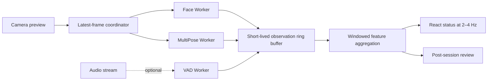

# Couple Lab — Realtime Video, Desktop, Calm Gamification, and Android Roadmap

**Decision date:** 2026-08-06; implementation note updated 2026-08-13
**Status:** Web Stage 1 plus Windows enrollment, low-frequency live identity, post-session VAD transcription and descriptive camera/acoustic metrics implemented; live diarization, overlap and automatic-feedback release remain evidence-gated

This document records the researched technical direction for realtime analysis and Android. It does not authorize stronger emotional or clinical claims.

## Product constraints

- The experience must help a couple practice, not score one partner against the other.
- Raw camera/audio data remains on-device. Retention requires an explicit shared consent action, clear local-storage wording, and visible delete controls.
- Models may describe observable geometry or interaction timing; they must not claim love, anger, deception, intent, abuse, diagnosis, or relationship outcome.
- Every signal needs an `insufficient quality` state. Absence of a detected face is not a behavioral cue.
- The UI must remain useful with camera, microphone, transcription, or ML unavailable.

## Implemented in Stage 1

- Installable PWA shell: manifest, service worker, standalone theme, and an Android install prompt when the browser exposes it.
- Phone layout: four-item bottom navigation, safe-area spacing, 44px minimum controls, compact practice camera, and focus/scroll reset on navigation.
- Android Back support through browser history and `popstate`.
- Explicit practice-entry activation: entering Practice Studio now requests camera/microphone once so the live preview and identity preparation are ready; recording still requires a separate action and stored shared consent.
- Mobile capture profile: user-facing camera, bounded resolution/frame rate, echo cancellation, noise suppression, and lower recording bitrate.
- Adaptive analysis: mobile samples less often and runs Pose on alternating samples; duplicate video frames and hidden pages are skipped.
- Media lifecycle cleanup: recording, recognition, tracks, models, and Blob URLs are released on unmount.
- A 15-minute hard stop limits in-memory recording growth. Saving or stopping the camera is disabled while recording.
- Recording starts only after shared consent; after Stop, the WebM is saved device-locally in IndexedDB before analysis. Insights provides playback and per-recording deletion.
- The session state is explicit (`setup → recording → finalizing → saving → analyzing → ready/error`); scores are not computed live and insufficient evidence produces no score.
- A bounded local diagnostics log records technical phases/errors without transcript, names, frames, or conversation content.
- New calibrations store only the left/right mapping, not a face snapshot.
- Nonverbal durations count unique sample intervals instead of multiplying every label in one frame.
- Camera analysis records coverage, geometry, head-orientation changes and normalized movement; it does not create new emotion-state observations.
- Post-session Windows transcription now runs packaged Silero VAD before Whisper and stores bounded speech segments plus speech/silence metadata.
- A local energy extractor records descriptive pause, coverage, relative-level-shift and estimated speaking-rate metrics without assigning emotion.
- Live scores are hidden while recording so the couple can focus on the conversation.
- Calm gamification: a factual seven-day practice rhythm derived from saved sessions—no points, streak loss, confetti, badges, or partner competition.

Stage 1 improves stability and near-realtime feedback, but inference still runs synchronously on the main thread. It is not the final high-frequency realtime architecture.

## Model decision

| Signal | Current | Recommended target | Decision |
|---|---|---|---|
| Face geometry | MediaPipe Face Landmarker | MediaPipe Face Landmarker in a Worker | Keep; use blendshapes as geometry, not emotion truth |
| Two-person pose | MediaPipe Pose Landmarker Lite | MoveNet MultiPose Lightning | Benchmark, then replace if identity continuity and latency win |
| Speech activity | Silero VAD after Stop on Windows; browser transcript/manual cues on web | Live VAD with overlap/unknown state | Keep post-session segmentation; benchmark before using it for turn attribution |
| Transcription | Packaged Whisper tiny after Stop on Windows; Web SpeechRecognition on web | Larger Hebrew-capable local pack only after held-out benchmark | Keep manual fallback; do not make continuous transcription a dependency |
| Transcript cleanup | Optional reviewed Ollama-local proposal in Insights | Language-model cleanup only behind validation and human approval | Preserve immutable source, numbers, negation and segment order; recompute analysis only after acceptance |
| Identity enrollment | Four face-geometry + two CAM++ voice templates per partner on Windows | Live matching with explicit unknown/overlap | Keep shared consent, deletion/re-enrollment and never force a name |
| Custom models | CAM++ speaker embeddings in an Electron worker | Native/ONNX worker on Windows; LiteRT on Android | Keep one justified runtime per platform and benchmark before live use |
| Acoustic descriptors | Local energy/pause/level extractor | Add only validated, permissively licensed features | Do not ship openSMILE under its research-only public license; never label emotion |
| Active speaker | Mouth motion is only a weak fallback | Light-ASD/AV active-speaker benchmark | Prototype post-session first; no report impact until identity/overlap accuracy is measured |

### Why MoveNet MultiPose is the leading pose candidate

MoveNet MultiPose is designed for multiple people and includes tracking support. The official BlazePose model card describes multiple people as out of scope and says the pipeline may track one person in a multi-person scene. For a seated couple, this limitation is more important than API-level `numPoses` configuration.

Before replacement, compare both systems on the same consented test clips. A model choice is accepted only if it improves identity continuity, coverage, latency, heat, and battery on real Android hardware.

## Target web pipeline (Stage 2)

Rules:

1. At most one inference per model may be in flight.
2. A new frame replaces the waiting frame; old frames are never queued.
3. Preview frame rate is independent of inference rate.
4. Worker results contain timestamp, processing latency, quality, subject/session tracking id, observed feature, and confidence.
5. React receives throttled aggregate updates, not every landmark.
6. Raw landmarks and frames are discarded unless a user explicitly starts a diagnostic recording for local QA.
7. WebGPU is progressive enhancement; WASM remains the compatibility fallback.

Initial adaptive targets—not promises—are 5–10 face inferences/sec and 3–6 pose inferences/sec on a mid-tier Android phone. The scheduler lowers inference rate/resolution when p95 latency, dropped frames, temperature, or battery pressure rises.

## Windows desktop direction

Windows is now the primary product target for the private Tamar/Agmon installation. The existing React UI remains the renderer inside Electron.

Implemented desktop foundation and enrollment:

- production Electron loads the packaged Vite `dist` from the secure custom `couple-lab://app` origin rather than requiring localhost;
- renderer sandboxing, context isolation, navigation restrictions, a media-only permission allowlist and a restrictive CSP;
- a narrow preload/IPC bridge with sender validation;
- a versioned face/voice template contract, strict vector validation and Windows `safeStorage` encryption in the Electron user-data directory;
- per-partner and all-data deletion hooks, a runtime/storage status panel and portable Windows packaging commands.
- consented four-angle face enrollment using a light MediaPipe geometry descriptor;
- two eight-second voice samples per person, quality checks and local 192-dimensional CAM++ speaker embeddings in an Electron worker thread;
- packaged speaker model, no raw enrollment-media persistence, and an initial within-person versus cross-person separation report.
- packaged same-origin MediaPipe WASM and face/pose model files, so Windows enrollment and visual analysis do not require a CDN connection.
- resumable per-person registration with a guided hold/progress ring for four face angles and readable timed prompts for the two voice samples.

Implemented identity pilot (not yet benchmark-validated diarization):

- live face descriptors are matched to the enrolled A/B templates before and during recording to infer left/right placement;
- while recording, four-second PCM windows are embedded with CAM++ and matched with explicit score/margin thresholds;
- visible mouth movement is used only as a weaker fallback for the active speaker;
- uncertain or indistinguishable vectors produce `unknown`; manual speaker/placement correction remains in advanced controls;
- a separate post-session Silero VAD + Whisper pass now produces timestamped speech chunks, but does not attach them to A/B;
- the pilot still does not include overlap detection, labeled accuracy evidence or benchmark-validated diarization.

Implemented descriptive report inputs:

- each camera sample records capture coverage so missing faces/pose remain a quality state rather than a behavioral cue;
- face/pose geometry can contribute descriptive head-orientation change and normalized body-movement durations, but no emotion/intent label;
- post-session PCM produces speech/silence coverage, long pauses, relative level changes and estimated rate, then is discarded;
- `capture-quality` and low-level acoustic quality do not satisfy the relationship-analysis evidence gate by themselves.

Next evidence-gated desktop stage:

1. connect VAD timing to the current sliding speaker embeddings and add explicit overlap/low-confidence states;
2. benchmark whether incremental turn transcription improves over the implemented final post-session pass;
3. collect labeled Tamar/Agmon verification clips that were not used for enrollment;
4. benchmark Hebrew accuracy, identity swaps, false attribution, unknown rate, p95 latency and a full 15-minute session on the target Lenovo computer;
5. tune thresholds only from held-out evidence before treating automatic attribution as the default evidence source for feedback.

Model and licensing gates for the next stage:

- benchmark MoveNet MultiPose against the packaged MediaPipe Pose model before adding a second runtime or download;
- evaluate Light-ASD (or another permissively licensed active-speaker model) first as an offline/post-session prototype, including CPU latency and overlap cases; its repository license alone does not validate model weights, preprocessing dependencies or product accuracy;
- do not package openSMILE under the public research license. A commercial license or a separately implemented permissive feature extractor is required;
- audit MediaPipe model provenance, terms and network behavior before distribution beyond the current private pilot; packaged assets must remain same-origin/offline in Electron.

The stored templates are identity aids, not emotion, intent or relationship evidence. Raw enrollment clips are not retained once valid vectors have been created unless both partners explicitly choose otherwise.

## Target Android pipeline (Stages 3–4)

### Stage 3: Capacitor product shell

- Package the existing Vite `dist` with Capacitor.
- Add Android lifecycle handling: pause/resume, Back, process recreation, and interrupted-session recovery.
- Replace durable `localStorage` session data with versioned encrypted SQLite; preferences remain for non-sensitive settings only.
- Store optional video in app-specific files, never in `localStorage`; provide explicit share/delete actions.
- Declare and request `CAMERA`/`RECORD_AUDIO` only in the action that needs them.
- Stop camera/microphone and finalize a recoverable draft when the app backgrounds.
- Test physical-device rotation, lock screen, phone call, permission revocation, process death, and 10–15 minute heat/battery behavior.

### Stage 4: Native realtime plugin

- CameraX `ImageAnalysis` with `STRATEGY_KEEP_ONLY_LATEST`.
- LiteRT for face/pose models, using an accelerator only after device-specific benchmarking.
- Return compact derived observations to the web UI through a Capacitor plugin.
- Use session-only tracking IDs by default. Persistent identity templates are optional, explicit and device-local; never infer identity for a person who has not enrolled.
- Keep manual-only and audio-only practice modes.

The PWA is the current Android delivery path. It is not yet a Play Store package. MediaPipe files are now served from the app origin and cached after use, but they are not pre-cached, so a first PWA model load still needs access to the hosting origin. The Windows package includes them from first launch.

## Benchmark gate

Test at least one low-tier, one mid-tier, and one high-tier Android device. Use physical devices, not only an emulator.

Measure:

- cold model load and first useful result;
- p50/p95 inference latency per model;
- preview FPS, analyzed FPS, and dropped-frame count;
- UI long tasks/jank;
- peak memory and recording growth;
- battery and thermal state after 10 and 15 minutes;
- two-person coverage and identity swaps;
- portrait/landscape, low light, occlusion, touch/embrace, masks/glasses, and different skin tones;
- insufficient-signal rate and false cue rate;
- offline start after models have been intentionally packaged/cached.

Release gates:

- no growing frame queue;
- Stop remains responsive during inference;
- no camera/microphone after leaving practice or backgrounding;
- nonverbal seconds never exceed covered session time;
- every inference-derived insight can be rejected or relabeled;
- no regression in manual-only practice.

## Calm gamification model

Use practice as the reward. Suitable elements:

- `Our rhythm this week`: number/minutes of saved practices and observed skill categories.
- `Skills we revisited`: curiosity, validation, appreciation, repair, calming pause, intimacy/shared meaning.
- one shared weekly intention, including a neutral `rest this week` choice;
- a three-line closing ritual: heard, appreciated, next small step;
- a quiet confirmation after save that names practiced skills without grading quality.

Do not add points, leaderboards, partner comparisons, broken streak warnings, randomized rewards, confetti, rank tiers, or shame-based reminders. Practice score remains a review heuristic and must not become a game currency.

## Primary sources

- [MediaPipe Face Landmarker for Web](https://developers.google.com/edge/mediapipe/solutions/vision/face_landmarker/web_js)
- [Official MediaPipe Face Landmarker Worker sample](https://github.com/google-ai-edge/mediapipe-samples-web/blob/main/src/workers/face-landmarker.worker.ts)
- [MediaPipe Face Landmarker for Android](https://developers.google.com/edge/mediapipe/solutions/vision/face_landmarker/android)
- [BlazePose GHUM model card](https://storage.googleapis.com/mediapipe-assets/Model%20Card%20BlazePose%20GHUM%203D.pdf)
- [MoveNet pose-detection documentation and code](https://github.com/tensorflow/tfjs-models/blob/master/pose-detection/src/movenet/README.md)
- [TensorFlow Android pose example](https://github.com/tensorflow/examples/tree/master/lite/examples/pose_estimation/android)
- [LiteRT for Android](https://developers.google.com/edge/litert/android)
- [LiteRT for Web](https://developers.google.com/edge/litert/web)
- [CameraX image analysis](https://developer.android.com/media/camera/camerax/analyze)
- [ONNX Runtime Web](https://onnxruntime.ai/docs/tutorials/web/)
- [ONNX Runtime WebGPU](https://onnxruntime.ai/docs/tutorials/web/ep-webgpu.html)
- [Silero VAD](https://github.com/snakers4/silero-vad)
- [openSMILE public license](https://github.com/audeering/opensmile/blob/master/LICENSE)
- [Light-ASD repository and license](https://github.com/Junhua-Liao/Light-ASD)
- [MediaPipe terms](https://developers.google.com/edge/mediapipe/legal/tos)
- [Android on-device SpeechRecognizer](https://developer.android.com/reference/android/speech/SpeechRecognizer)
- [Capacitor documentation](https://capacitorjs.com/docs)
